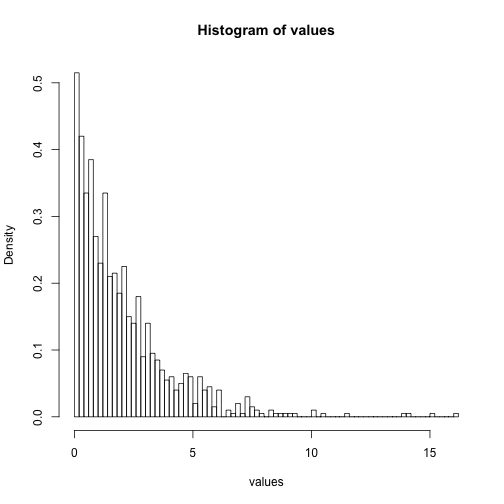

Presentation_test
========================================================
author: 
date: 
autosize: true

First Slide
========================================================

For more details on authoring R presentations please visit <https://support.rstudio.com/hc/en-us/articles/200486468>.

- Bullet 1
- Bullet 2
- Bullet 3

Slide With Code
========================================================


# Deliveable 1

## Exercise 1

1. Consider the continuous random variable $X$ with pdf:
$$
f(x) = \left\{
\begin{array}{ll}
     \frac{4}{3}(x^3 + x) \quad \qquad 0 < x < 1\\
     0, \qquad \qquad \qquad\text{for all others } x \text{ values}\\
\end{array} 
\right. 
$$

Now consider the random variable $Y = g(X)$, where $g(x) = log(x^2 + 4)$.
Estimate $P(1.3 < Y < 1.5)$ using the Monte Carlo Method, as well as the estimator standard deviation.

Slide With Code
========================================================
_____

$$
P(1.3 < Y < 1.5) \quad = \quad P(1.3 < g(x) < 1.5) \quad = \quad P(1.3 < log(x^2 + 4) < 1.5) \quad
$$

Given that $x$ only present values between $0 < x < 1$, that imples:

- the minimun value of $log(x^2 + 4)$ is $log(4)$ 
- the maximum value of $log(x^2 + 4)$ is $log(5)$ 

Therefore, we know that:

$$
P(1.3 < log(x^2 + 4) < log(4)) = 0
$$

With this taken into consideration, the probability that we want to calculate is:

Slide With Code
========================================================

$$
P(log(4) < log(x^2 + 4) < 1.5)
$$

Which we can know expand into:

$$
P(log(4) < log(x^2 + 4) < 1.5) \quad = \quad P(4 < x^2 + 4 < e^{1.5}) \quad = \quad P(0 < x^2  < e^{1.5}-4) \quad = \quad P(0 < x  < \sqrt{e^{1.5}-4})
$$ 

So, we now know that the probability we want to calculate can be obtain by the following integral:

\begin{equation} 
  \int_{0}^{\sqrt{e^{1.5}-4}} \frac{4}{3}(x^3 + x) dx
  (\#eq:integralProb)
\end{equation} 


Slide With Code
========================================================

```r
mc <- function(t){
  k <- sqrt(exp(1.5)-4)
  return ( (4/3) * ((k*t)^3 + k*t) *k )
}

#t follows an uniform

sample <- runif(100000)
pEst <- mean(mc(sample))

varEstimator <- (1/(length(sample)^2))*sum((mc(sample)-pEst)^2)
df <- data.frame(
  probEstimated = pEst,
  varianceMC = varEstimator
)

knitr::kable(df, format = knitr:::pandoc_to())
```

<table>
 <thead>
  <tr>
   <th style="text-align:right;"> probEstimated </th>
   <th style="text-align:right;"> varianceMC </th>
  </tr>
 </thead>
<tbody>
  <tr>
   <td style="text-align:right;"> 0.3992237 </td>
   <td style="text-align:right;"> 7e-07 </td>
  </tr>
</tbody>
</table>

Slide With Code
========================================================
## Exercise 2

### 2.1

### 2.2


```r
lambda <- 0.5
samples <- runif(1000)


inverseExp <- function(u, lambda){
  -(1/lambda)*log(1-u)
}

values <- inverseExp(samples, lambda)

hist(values, breaks=100, freq = F)
```



```r
g <- function(x){
  exp(sqrt(x))*(2/(sqrt(2*pi)))*x^(-1/2)
}

X <- runif(10000)
Y <- runif(10000)

EX <- mean(g(inverseExp(X, lambda)))
EY <- mean(g(inverseExp(Y, lambda)))
```
